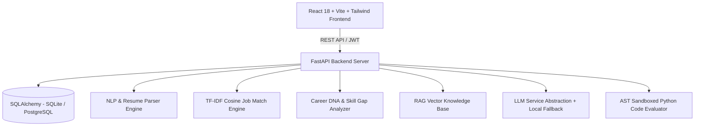

# CAREERMIND AI

### "Your AI-Powered Career Intelligence Platform"
*Build Skills. Find Direction. Get Career Ready.*

---

## 🌟 Executive Summary

**CareerMind AI** is an advanced AI/ML career operating system designed for students, fresh graduates, and tech job seekers. It converts static resumes and career goals into an actionable, AI-driven feedback loop encompassing:

* **Career DNA Generation**: Radar skill graph mapping strengths, gaps, and job-readiness stage.
* **AI Resume Intelligence**: File parsing (PDF/DOCX/TXT), section extraction, and transparent CareerMind ATS-style quality analysis.
* **Semantic Job Matching**: TF-IDF & Text Embeddings cosine similarity matching engine with transparent score breakdowns.
* **Target Role Skill Gap Analysis**: Market-benchmarked priority skill rankings and addressable project recommendations.
* **Personalized 6-Month Career Roadmap**: Actionable month-by-month learning milestones with interactive status tracking.
* **AI Mock Interviews & Coding Assessment**: Adaptive interview question generator, answer quality evaluator, post-interview performance reports, and sandboxed Python coding evaluator.
* **RAG Career Knowledge Assistant**: Grounded Q&A over career guides and interview topics with source citations.
* **Job Application Tracker & Analytics**: Kanban application pipeline and admin platform analytics.

---

## 🏗️ System Architecture



---

## 🛠️ Technology Stack

### Frontend
* **Core**: React.js, Vite, JavaScript (ES6+)
* **Styling**: Tailwind CSS v4, Custom Dark SaaS Theme (`#0B0F19`), Glassmorphism, Electric Cyan/Indigo/Violet Gradients
* **Icons & Data Viz**: Lucide React, Recharts (`RadarChart`, `ResponsiveContainer`)
* **Routing & State**: React Router v6, Axios Centralized Interceptors, React Auth Context

### Backend
* **Core**: Python 3.11/3.14, FastAPI, Pydantic v2
* **Database**: PostgreSQL / SQLite dynamic session handling via SQLAlchemy 2.0
* **Auth**: Native bcrypt password hashing & HS256 JWT tokens

### AI / ML & NLP
* **NLP & Matching**: Scikit-Learn (TF-IDF Vectorizer, Cosine Similarity), PyPDF, Python-Docx, Regex Section Boundary Extractor
* **RAG Pipeline**: Vector Index Matrix over Career Knowledge Base chunks
* **LLM Layer**: OpenAI / Groq API provider abstraction + Local Intelligent AI Fallback Engine
* **Sandbox**: AST Code Safety Validator + Limited Builtins Execution Scope

---

## 🚀 Quick Start Guide (Local Zero-Config Run)

### 1. Clone & Set Up Environment
```bash
git clone https://github.com/your-repo/CareerMind-AI.git
cd CareerMind-AI
```

### 2. Run Backend (FastAPI)
```bash
# Install Python dependencies
pip install -r backend/requirements.txt

# Start FastAPI dev server (auto-creates database & seeds demo data)
python -m uvicorn backend.main:app --host 127.0.0.1 --port 8000 --reload
```
Backend API interactive documentation available at: `http://127.0.0.1:8000/docs`

### 3. Run Frontend (React + Vite)
Open a new terminal window:
```bash
cd frontend
npm install
npm run dev
```
Open `http://localhost:5173` in your browser.

---

## 🐳 Docker Deployment

To launch the complete production stack (PostgreSQL + FastAPI Backend + Nginx/React Frontend) using Docker Compose:

```bash
docker-compose up --build
```
* **Frontend**: `http://localhost:5173` (or `http://localhost:80`)
* **Backend API**: `http://localhost:8000`
* **PostgreSQL Database**: `localhost:5432`

---

## 🧪 Testing

Run backend pytest suite verifying health, authentication, job matching, and skill gap engines:
```bash
python -m pytest backend/tests/test_api.py
```

Run frontend build verification:
```bash
cd frontend
npm run build
```

---

## 🎓 Viva-Friendly Technical Concepts (For MCA & Portfolio Reviews)

When presenting this project for an MCA Major Project viva or technical job interview, explain:

1. **Why Cosine Similarity for Job Matching?**
   Cosine similarity measures the angle between TF-IDF document vectors regardless of document length, preventing long job descriptions from artificially skewing matching scores.
2. **Why RAG instead of Fine-Tuning?**
   RAG allows injecting fresh, updated career knowledge chunks into prompt context without costly model re-training or hallucination risks.
3. **How does Resume Parsing work without regex brittleness?**
   The parser combines regex section headers with NLP keyword taxonomy lookup, extracting skills independently of structural variations.
4. **How is Security Maintained?**
   Uploaded resumes and user input are treated strictly as DATA variables in LLM prompts, mitigating prompt injection attacks. Coding challenges parse Python AST to block prohibited module imports (`os`, `sys`, `subprocess`).

---

## 📄 License
MIT License. Built for production software engineering and AI portfolio demonstrations.
