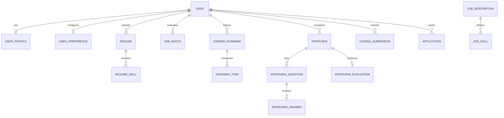

# Database Schema Design - CAREERMIND AI

## Entity Relationship Overview

CareerMind AI implements 24 relational database models designed in SQLAlchemy for PostgreSQL & SQLite:

## Table Definitions

### 1. `users`
* `id` (INTEGER, PK)
* `name` (VARCHAR)
* `email` (VARCHAR, UNIQUE, INDEX)
* `password_hash` (VARCHAR)
* `is_active` (BOOLEAN)
* `created_at` (DATETIME)

### 2. `user_profiles`
* `id` (INTEGER, PK)
* `user_id` (INTEGER, FK -> users.id)
* `target_role` (VARCHAR)
* `experience_level` (VARCHAR)
* `years_of_experience` (FLOAT)
* `skills` (JSON)
* `education` (VARCHAR)

### 3. `resumes`
* `id` (INTEGER, PK)
* `user_id` (INTEGER, FK -> users.id)
* `filename` (VARCHAR)
* `parsed_text` (TEXT)
* `structured_data` (JSON)
* `ats_score` (FLOAT)
* `ats_breakdown` (JSON)
* `improvement_suggestions` (JSON)

### 4. `job_matches`
* `id` (INTEGER, PK)
* `user_id` (INTEGER, FK -> users.id)
* `job_id` (INTEGER, FK -> job_descriptions.id)
* `overall_score` (FLOAT)
* `semantic_similarity` (FLOAT)
* `skill_coverage` (FLOAT)
* `matched_skills` (JSON)
* `missing_skills` (JSON)
* `explanation` (TEXT)
