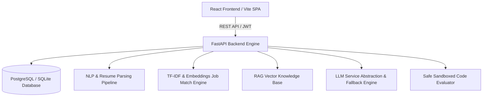

# System Architecture Specification - CAREERMIND AI

## 1. Overview
CareerMind AI is an advanced AI/ML career intelligence operating system designed for students, fresh graduates, and tech job seekers. It features an end-to-end modular architecture combining Natural Language Processing (NLP), TF-IDF & Embedding cosine similarity algorithms, Retrieval-Augmented Generation (RAG), and adaptive AI Mock Interview simulators.

## 2. Core Subsystems

### 2.1 Frontend (CAREER COMMAND CENTER)
* **Framework**: React.js with Vite
* **Styling**: Vanilla CSS & Tailwind CSS v4 custom dark theme (`#0B0F19` foundation, glassmorphism blur effects, electric cyan/indigo accent gradients)
* **Charts**: Recharts (`RadarChart` for Career DNA, bar charts for skill analytics)
* **State & Routing**: React Router v6, React Auth Context with JWT interceptors.

### 2.2 Backend API Core
* **Framework**: Python 3.11/3.14 + FastAPI
* **ORM**: SQLAlchemy 2.0 with session pooling & SQLite/PostgreSQL dynamic fallback
* **Auth**: Native bcrypt password hashing & HS256 JWT tokens.

### 2.3 AI/ML & NLP Engine
* **Resume Parsing**: PyPDF & Python-Docx text extraction with regex section boundary detection.
* **Skill Extraction**: Word boundary regex taxonomy matching across 100+ technical skills.
* **Job Compatibility**: Weighted matching formula combining skill overlap ratio, TF-IDF cosine similarity, and experience alignment.
* **RAG Pipeline**: Document chunking, TF-IDF / Vector index matrix representation, cosine similarity chunk retrieval, prompt injection protection.
* **Coding Sandbox**: Python AST syntax parsing to block prohibited modules (`os`, `sys`, `subprocess`) before executing test cases in restricted scope.
